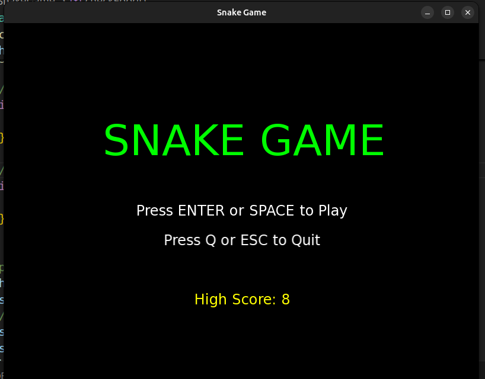
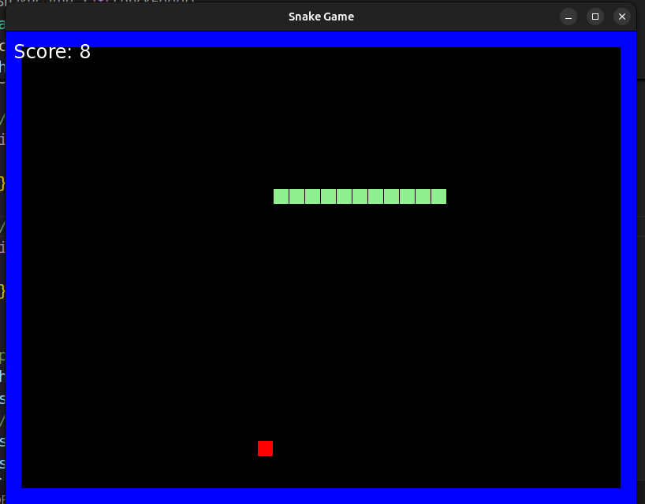
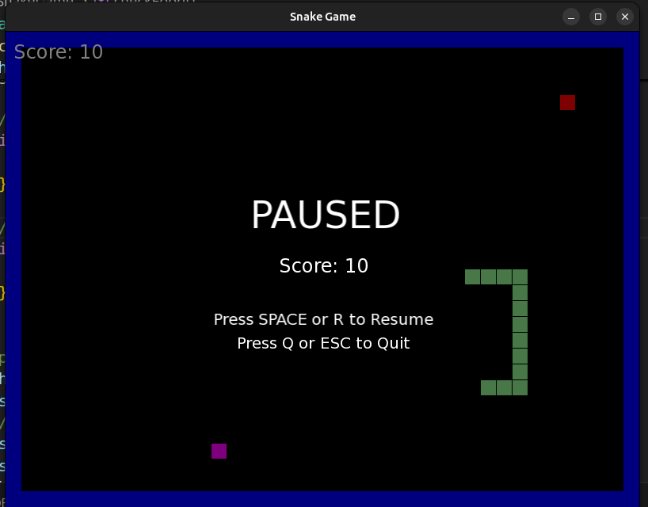
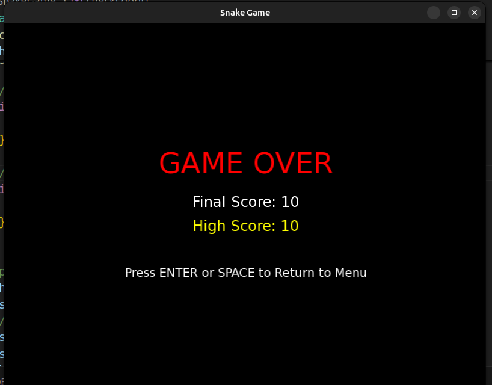

# 🐍 Snake Game - C++ & SFML

A classic Snake game implementation using C++ and SFML library with modern game mechanics, multiple game states, and smooth gameplay experience.

## 📸 Screenshots

### Main Menu


### Gameplay


### Pause Menu


### Game Over Screen


## 🎮 Game Features

### Core Gameplay
- **Classic Snake Mechanics**: Control a light green snake that grows as it eats food
- **Smooth Controls**: Move using Arrow keys or WASD keys
- **Wall Boundaries**: Blue walls around the game area - touching them ends the game
- **Self-Collision**: Game ends if snake hits itself
- **Progressive Difficulty**: Snake speed increases as score grows

### Food System
- **Regular Food** (Red): Worth +1 point, spawns randomly
- **Special Food** (Magenta): Worth +5 points, appears every 10 points
- **Time Limited**: Special food disappears after 5 seconds if not eaten
- **Smart Spawning**: Food never spawns on the snake's body

### Game States & UI
- **Main Menu**: Clean interface with Play and Quit options
- **Active Gameplay**: Real-time score display and smooth movement
- **Pause System**: Press Space to pause/resume with overlay menu
- **Game Over Screen**: Shows final score, high score, and menu return option

### Scoring & Persistence
- **Score Tracking**: Real-time score display during gameplay
- **High Score System**: Automatically saves and loads high scores
- **File Persistence**: High scores saved to `highscore.txt`

## 🛠️ Technical Implementation

### Architecture
- **State Machine**: Clean separation of Menu, Playing, Paused, and Game Over states
- **Object-Oriented Design**: Modular code structure with clear responsibilities
- **Event-Driven Input**: Responsive controls with proper input handling
- **Collision Detection**: Efficient boundary and self-collision checking

### Key Features
- **Random Food Generation**: Uses proper random number generation for food placement
- **Frame Rate Control**: Locked at 60 FPS for smooth gameplay
- **Memory Management**: Efficient use of STL containers and RAII principles
- **Cross-Platform**: Compatible with Windows, Linux, and macOS

### Game Mechanics
- **Direction Buffering**: Prevents invalid moves (e.g., moving directly backwards)
- **Growth System**: Snake grows appropriately when eating different food types
- **Speed Scaling**: Gradual speed increase based on score progression
- **Timer System**: Proper timing for special food duration and game updates

## 🎯 Controls

| Action | Keys |
|--------|------|
| **Move Up** | ↑ Arrow Key or W |
| **Move Down** | ↓ Arrow Key or S |
| **Move Left** | ← Arrow Key or A |
| **Move Right** | → Arrow Key or D |
| **Pause/Resume** | Space Bar |
| **Start Game** | Enter or Space (in menu) |
| **Quit** | Q or Escape |
| **Resume (Paused)** | Space or R |

## 🏆 Scoring System

- **Regular Food**: +1 point per red food eaten
- **Special Food**: +5 points per magenta food eaten
- **Special Food Trigger**: Appears every 10 points scored
- **High Score**: Automatically tracked and persisted across sessions

## 📋 Requirements

### For Running (Pre-built Version)
- **Windows**: Windows 7 or later
- **Linux**: Any modern distribution
- **macOS**: macOS 10.12 or later

### For Building from Source
- **C++ Compiler**: GCC 7+ or equivalent with C++17 support
- **SFML Library**: Version 2.5 or later
- **CMake**: Version 3.10+ (optional, for build system)

## 🔧 Building from Source

### Linux/macOS
```bash
# Install SFML
sudo apt install libsfml-dev  # Ubuntu/Debian
# or
brew install sfml            # macOS with Homebrew

# Compile
g++ -o snake_game snake_game.cpp -lsfml-graphics -lsfml-window -lsfml-system

# Run
./snake_game
```

### Windows (MinGW)
```bash
# Compile (assuming SFML is installed)
g++ -o snake_game.exe snake_game.cpp -lsfml-graphics -lsfml-window -lsfml-system

# Run
snake_game.exe
```

## 🤝 Contributing

Feel free to contribute to this project! Some ideas:
- Add sound effects and background music
- Implement different game modes (multiplayer, AI snake, etc.)
- Add power-ups and special abilities
- Create different themes and visual styles
- Improve graphics with sprites and animations

## 📝 License

This project is open source and available under the [MIT License](LICENSE).

## 👨 Project

C++ Game Project 

---

**Enjoy the game!** 🎮🐍